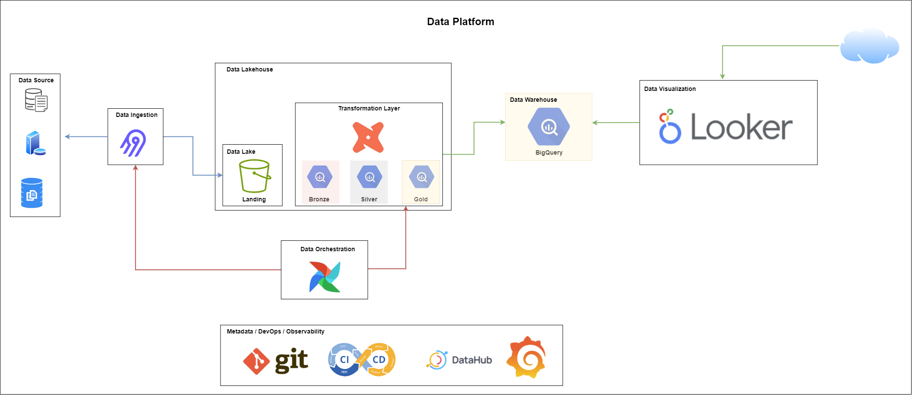

# Plataforma de Dados - Data Lakehouse

Esta arquitetura segue o modelo **medalhão** (Bronze - Silver - Gold), combinando **ingestão, transformação, armazenamento, catalogação, governança e observabilidade**.

  

---

## 1. Arquitetura Medalhão (Camadas de Dados)

O modelo medalhão organiza os dados em três camadas principais, cada uma com responsabilidades distintas:

| Camada    | Objetivo | Características |
|-----------|---------|----------------|
| **Bronze** | Dados brutos | Dados ingeridos de fontes externas, **sem transformação**. Mantém histórico completo e serve como ponto de partida para reprocessamentos. |
| **Silver** | Dados refinados | Dados tratados, limpos e parcialmente transformados. Aplicação de regras de negócio básicas, padronização de formatos, integração entre fontes. Pronto para análises exploratórias ou relatórios intermediários. |
| **Gold**   | Dados consumíveis | Camada final, otimizada para consumo por BI, dashboards ou modelos de ML. Dados consolidados, agregados, com alta qualidade e consistência garantida. |

**Benefícios do modelo medalhão:**
- Reduz risco de inconsistências entre fontes e transformações.  
- Facilita rastreabilidade e auditoria dos dados.  
- Permite que pipelines e análises sejam evoluídos de forma incremental e segura.

---

## 2. Ingestão de Dados
- **Airbyte**  
  - Ferramenta de ingestão ELT.
  - Extrai dados de múltiplas fontes e carrega na camada **Landing** no **GCS**.
  - Padroniza a captura de dados brutos e mantém histórico.

---

## 3. Armazenamento de Dados Brutos
- **GCS (Google Cloud Storage) – Landing**  
  - Armazena dados originais de forma segura.
  - Serve como ponto inicial do pipeline e permite reprocessamento quando necessário.

---

## 4. Transformação e Estruturação de Dados
- **dbt (Data Build Tool)**  
  - Realiza transformações aplicando regras de negócio.
  - Cria camadas **Bronze - Silver - Gold** no BigQuery.
  - Gerencia testes de qualidade de dados (unicidade, valores nulos, integridade).
  - Documenta tabelas e rastreia lineage de dados.

---

## 5. Orquestração de Pipelines
- **Airflow**  
  - Coordena a execução completa dos pipelines de ingestão e transformação.
  - Monitora status das DAGs, logs e retries automáticos.

---

## 6. Armazenamento e Consumo de Dados
- **BigQuery**  
  - Armazena as camadas Bronze, Silver e Gold.
  - Fonte para Looker, pipelines de ML e análises ad-hoc.

- **Looker**  
  - Plataforma de BI para análise e dashboards baseados nas tabelas Gold do BigQuery.

---

## 7. Governança e Catálogo de Dados
- **DataHub**  
  - Catalogação de datasets, colunas, donos e tags de sensibilidade.
  - Rastreabilidade completa (lineage) integrando dbt, Airflow e BigQuery.
  - Centraliza governança e histórico de alterações.

---

## 8. Observabilidade e Monitoramento
- **Grafana**  
  - Dashboards para saúde do pipeline e qualidade dos dados.
  - Centraliza métricas de Airflow, dbt e volumes/latência de processamento.

---

## 9. Versionamento e Automação
- **Repositório Git**  
  - Armazena o código dos pipelines e modelos dbt.
  - Garante versionamento e histórico de alterações.

- **Processo de CI/CD**  
  - Automatiza build, testes e deploy dos pipelines.
  - Garante consistência e confiabilidade no ambiente de produção.

---

## Fluxo de Dados Resumido
1. **Ingestão:** Airbyte - GCS Landing  
2. **Transformação:** dbt - Bronze - Silver - Gold no BigQuery  
3. **Orquestração:** Airflow gerencia execução de ingestão e transformação  
4. **Consumo:** Looker / pipelines ML acessam Gold no BigQuery  
5. **Governança:** DataHub documenta, rastreia lineage e mantém catálogo  
6. **Qualidade e monitoramento:** dbt tests + Grafana dashboards  
7. **Versionamento e automação:** Git + CI/CD validam e deploy de código

